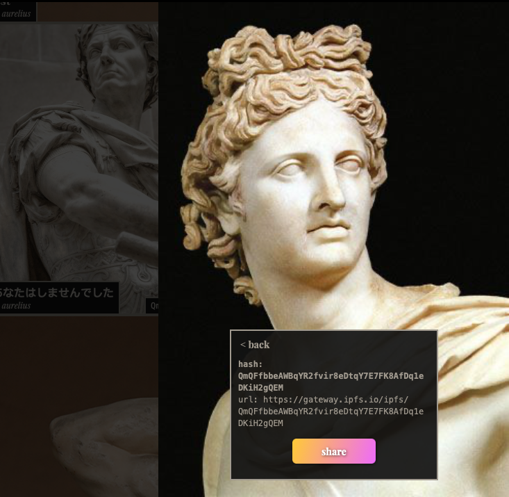
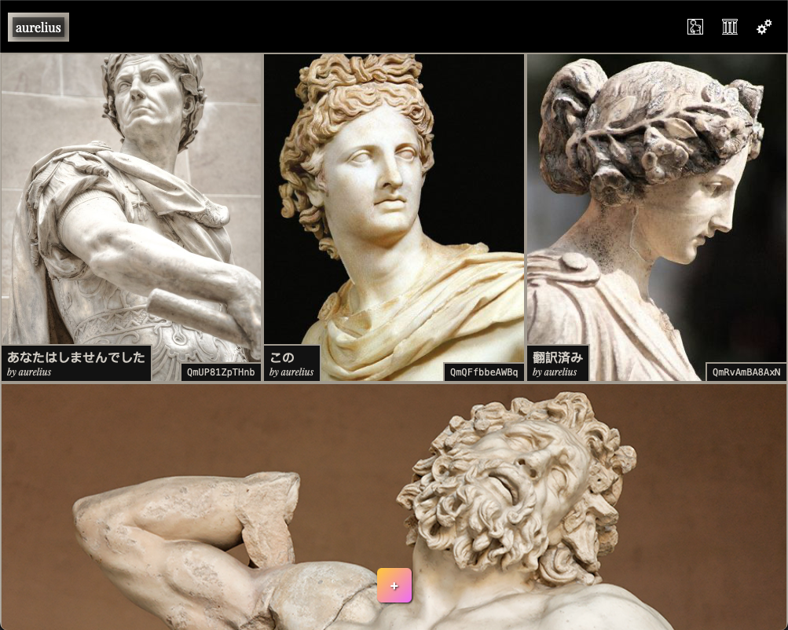

# La Marque

Real-time Depth Rendering Audio/Visual iOS Application. That converts 2D images into interact-able 3D point clouds.

This is an iOS App, macOS App I had made a while back. There isn't any inherent utility behind besides demonstrating a couple technologies and being sort of an Abstract Art Exhibition of sorts.

Wanted to open source this in preparation for xrOS and anyone that may want a starting point in potentially creating mixed reality experiences. This Repo will be updated in accordance to new knowledge and updates from xrOS. In accordance, MarbleKit and GlassKit will also be updated to support the rendering and audio side separately outside of the app, as this demo application is dependent on both Swift Packages.

**Table of Contents**
- [Requirements](#requirements)
- [Technologies](#technologies)
- [Swift Packages](#swift-packages)
- [Guide](#guide)
- [Credits](#credits)

## IMPORTANT

HAVE NOT TESTED ON M-CHIP Macs yet, as my personal is still Intel 

This app uses an archived design pattern of mine [GraniteUI](https://github.com/pexavc/graniteui). If you’d like to use it, beware I won’t be updating it anymore as I moved on to my latest one [Granite](https://github.com/pexavc/granite). Components should still be separable and plucked out easily, for your own personal needs in a native SwiftUI app.

A package that is NOT public and has been removed from the app is **MarqueKit**. I have commented `[CAN REMOVE]` at various locations that used this kit. It was meant for encoding and decoding as images were the primary form of sharing information in the application with other users.

> Some features in the app may not be functional due to this.
> 

## Requirements

- `macOS 11.0+`  ***Build passing*** 🟢
- `iOS 14.0+`  ***Not tested*** 🟡

## Technologies

- Metal
- CoreData
- CoreML
- SwiftUI
- Apple Extensions
  - Share
  - Action

## Swift Packages

- [GraniteUI](https://github.com/pexavc/GraniteUI)
- [GlassKit](https://github.com/pexavc/GlassKit)
- [MarbleKit](https://github.com/pexavc/MarbleKit)

## Guide

[WIP]

## Credits

Some code have been re-attributed from other sources, collected over time. Some do not have comment headers, because I realized the same code was attributed as well from other sources. Here I will link exact credits for some of these logics.

Location: `/Resources/Design/System`

**Pure Swift UI** by [@Brett-Best](https://github.com/Brett-Best)

[https://github.com/CodeSlicing/pure-swift-ui](https://github.com/CodeSlicing/pure-swift-ui)

**SwiftBase58** by [@NeoTeo](https://github.com/NeoTeo)

[https://github.com/NeoTeo/SwiftBase58/](https://github.com/NeoTeo/SwiftBase58/)

Depth maps are generated from a custom quantized CoreML model (67Mb) based on this

Location: `/Core/Exhibition/AI`

**MiDaS** by [@isl-org](https://github.com/isl-org)

[https://github.com/isl-org/MiDaS](https://github.com/isl-org/MiDaS)

The test song, `Glass` is by me, not copyrighted. 

## More Previews

